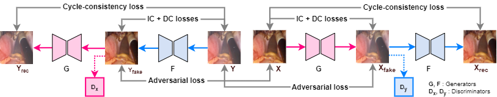

# DeSmoke-LAP: Improved Unpaired Image-to-Image Translation for Desmoking in Laproscopic Surgery

## Model Architecture

The model is built based on the architecture of <a href="https://github.com/junyanz/pytorch-CycleGAN-and-pix2pix">CycleGAN</a> network, and two additional loss functions are added for inter-channel discrepancies and dark channel prior.

## Sample Clips

Result comparisons on clips can be assess in the <a href="https://github.com/yiroup20/DeSmoke-LAP/tree/main/video%20clips">'video clips'</a> folder.

<!--   -->

<!--  (a)Input (b)CycleGAN (c)FastCUT (d)GAN-DC (e)Proposed -->

## Prerequisites
- Linux or macOS
- Python 3
- CPU or NVIDIA GPU + CUDA CuDNN

### Model train/test
- You can follow the steps in our provided <a href="https://github.com/yiroup20/DeSmoke-LAP/blob/main/DeSmoke-LAP.ipynb">Colab Notebook</a> to train with your own data or use our pretrained models.

<!-- ## Related Projects
- [contrastive-unpaired-translation](https://github.com/taesungp/contrastive-unpaired-translation) (CUT)
- [pytorch-CycleGAN-and-pix2pix](https://github.com/junyanz/pytorch-CycleGAN-and-pix2pix) -->

## Acknowledgments
Our code is inspired by [pytorch-CycleGAN-and-pix2pix](https://github.com/junyanz/pytorch-CycleGAN-and-pix2pix).
